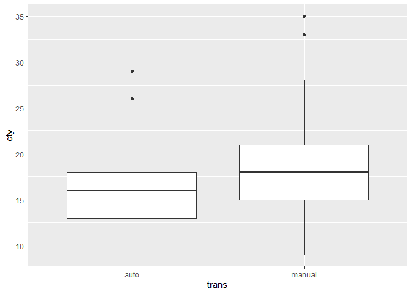

```r
library(ggplot2)
library(dplyr)
```

```
## 
## 다음의 패키지를 부착합니다: 'dplyr'
```

```
## The following objects are masked from 'package:stats':
## 
##     filter, lag
```

```
## The following objects are masked from 'package:base':
## 
##     intersect, setdiff, setequal, union
```

## 통계 검정
- p.176
### 가설
- Hypothesis

- 연구     : 자신의 궁금한 것을 찾는 것

- 귀무가설 : 두 그룹간의 평균 차이가 없다
- 대립가설 : 두 그룹간의 평균 차이가 있다

- 가설 검정에서 인정하는 유의수준
 +5%, 1%, 0.1%, 또는 10%
 
 남자 평균 키와, 여자 평균 키 실험
 유의수준 > 0.05 
 
 t.test
- 어떻게 데이터를 입력하는지 확인
- p-value, 유의수준 0.05 이상 : 귀무가설, 0.05 이내 --> 대립가설


```r
mpg1 <- read.csv("data/mpg1.csv", stringsAsFactors = FALSE)
str(mpg1)
```

```
## 'data.frame':	234 obs. of  5 variables:
##  $ manufacturer: chr  "audi" "audi" "audi" "audi" ...
##  $ trans       : chr  "auto" "manual" "manual" "auto" ...
##  $ drv         : chr  "f" "f" "f" "f" ...
##  $ cty         : int  18 21 20 21 16 18 18 18 16 20 ...
##  $ hwy         : int  29 29 31 30 26 26 27 26 25 28 ...
```

- 시각화 

```r
library(ggplot2)
ggplot(mpg1, aes(x = trans, y = cty)) + 
  geom_boxplot()
```

<!-- -->
 - t.test 검정
  + 귀무가설 : auto와 manual의 ctv 평균은 차이가 없다.
  + 대립가설 : auto와 manual의 ctv 평균은 차이가 있다.
  

```r
t.test(data = mpg1, cty ~ trans)
```

```
## 
## 	Welch Two Sample t-test
## 
## data:  cty by trans
## t = -4.5375, df = 132.32, p-value = 1.263e-05
## alternative hypothesis: true difference in means between group auto and group manual is not equal to 0
## 95 percent confidence interval:
##  -3.887311 -1.527033
## sample estimates:
##   mean in group auto mean in group manual 
##             15.96815             18.67532
```

```r
               # 종속변수 ~ 독립변수
               # 반응변수 ~ 설명변수
               # y          x               
```


-두 그룹의 평균 차이 검정
 + 사전 필수 검증
 + 등분산 검정
   + 두 그룹간의 분산이 비슷하면 --> t.test (모수 검정)
   + 두 그룹간의 분산이 다르면, --> 비모수 검정
 + 등분산 검정
   + 귀무가설 : 두 그룹간의 분산이 비슷하다.
     - p.value > 0.05
   + 대립가설 : 두 그룹간의 분산이 다른다


```r
var.test(data = mpg1, cty~trans)
```

```
## 
## 	F test to compare two variances
## 
## data:  cty by trans
## F = 0.73539, num df = 156, denom df = 76, p-value = 0.1101
## alternative hypothesis: true ratio of variances is not equal to 1
## 95 percent confidence interval:
##  0.4912917 1.0719468
## sample estimates:
## ratio of variances 
##          0.7353887
```


```r
ggplot(mpg1, aes(x = cty, fill = trans)) + 
  # geom_histogram() +
  geom_density(alpha = 0.1)
```

<!-- -->
  
  

### 교차 분석
- 범주형 변수들이 관계가 있다는 것을 검정
- 비율에 차이가 있는지 검정
- 교차분석 검정은 R의 chisq.test() 함수로 진행
- 귀무가설 : trans에 따라 drv(4, f, r)의 (비율)차이가 없다.
- 대립가설 : trans에 따라 drv의 차이가 있다.
- 빈도표 / 비율


```r
table(mpg1$trans, mpg1$drv) # 교차분석
```

```
##         
##           4  f  r
##   auto   75 65 17
##   manual 28 41  8
```

- 비율

```r
prop.table(table(mpg1$trans, mpg1$drv), 1)
```

```
##         
##                  4         f         r
##   auto   0.4777070 0.4140127 0.1082803
##   manual 0.3636364 0.5324675 0.1038961
```
- auto 4륜 구동(4)인 47.8%
- manual 전륜구동(f) 53.2% 가장 많음
- 실제로 통계적으로 봤을 때, 차이가 있는지 검정 

- 교차분석 검정은 R의 chisq.test() 함수로 진행
- 귀무가설 : trans에 따라 drv(4, f, r)의 (비율)차이가 없다.
- 대립가설 : trans에 따라 drv의 차이가 있다.


```r
chisq.test(mpg1$trans, mpg1$drv)
```

```
## 
## 	Pearson's Chi-squared test
## 
## data:  mpg1$trans and mpg1$drv
## X-squared = 3.1368, df = 2, p-value = 0.2084
```

