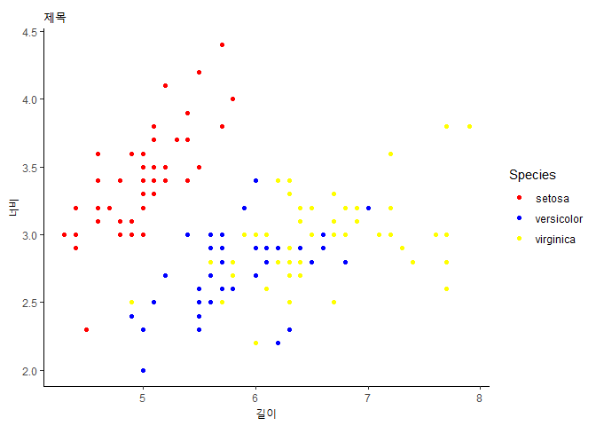
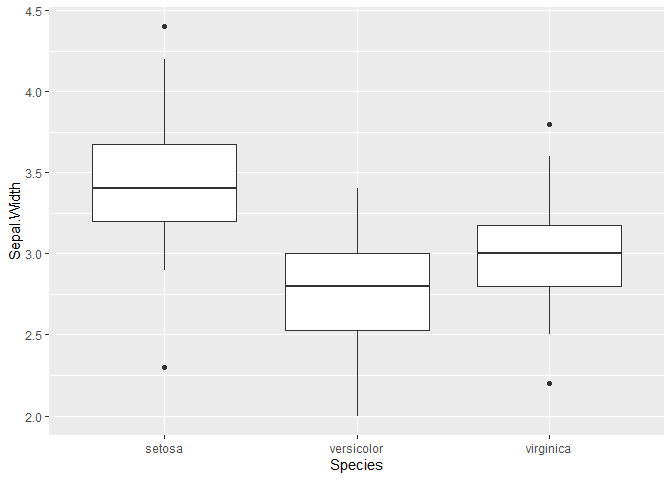

## 제목 1
ㅁㅁㅁㅁㅁㅁ

### 소제목 1
ㅁㄴㅇㅁㄴㅇ

## 제목 2
ㅁㄴㅇㅁㄴㅇ

### 소제목 1-1


## 복습

iris 데이터, sepal. length, sepal. width 활용해서
종별로 산점도를 그리세요.
-제목과 x축, y축을 제목을 변경하세여.
+ x축 길이, y축 너비


```r
library(ggplot2)
library(dplyr)
```

```
## 
## 다음의 패키지를 부착합니다: 'dplyr'
```

```
## The following objects are masked from 'package:stats':
## 
##     filter, lag
```

```
## The following objects are masked from 'package:base':
## 
##     intersect, setdiff, setequal, union
```

```r
str(iris)
```

```
## 'data.frame':	150 obs. of  5 variables:
##  $ Sepal.Length: num  5.1 4.9 4.7 4.6 5 5.4 4.6 5 4.4 4.9 ...
##  $ Sepal.Width : num  3.5 3 3.2 3.1 3.6 3.9 3.4 3.4 2.9 3.1 ...
##  $ Petal.Length: num  1.4 1.4 1.3 1.5 1.4 1.7 1.4 1.5 1.4 1.5 ...
##  $ Petal.Width : num  0.2 0.2 0.2 0.2 0.2 0.4 0.3 0.2 0.2 0.1 ...
##  $ Species     : Factor w/ 3 levels "setosa","versicolor",..: 1 1 1 1 1 1 1 1 1 1 ...
```

```r
ggplot(iris, aes(x = Sepal.Length,
                 y = Sepal.Width,
                 colour = Species)) +
  geom_point() +
  labs(
    title = "제목",
    x = "길이",
    y = "너비",
  ) +
  scale_color_manual(
    labels = c("setosa", "versicolor", "virginica"),
    values = c("red", "blue", "yellow")
  ) +
  theme_classic()
```

<!-- -->
- boxplot

```r
ggplot(iris, aes(x = Species, y = Sepal.Width)) + 
  geom_boxplot()
```

<!-- -->


## 통계
- 기술통계 : 평균, 최솟값, 최댓값, 중간값
- 추론통계 : 변수 간의 관계를 파악 / 새로운 사실을 발견
(= 추정)
 + 평균 차이 검정
  -가설검정 : 평균의 차이를 검정
  - 남자의 평균키와 여자의 평균 키는 차이가 있을 것이다.
  
  + 교차분석(= 빈도분석)
    - 가설검점 : 각 범주별 빈도를 활용해서
    관계성을 검정
    
    + 상관관계분석
     - 수치 데이터
     - 두 변수간의 상관계가 있다? 없다?
    + 단순회귀분석
     - y = ax + b
     - 기온, 판매량
     - 가설검정
      + 기온 (독립변수) 가 판매량 (종속변수)에 긍정적인 영향을 주고 있을 것이다.
      

